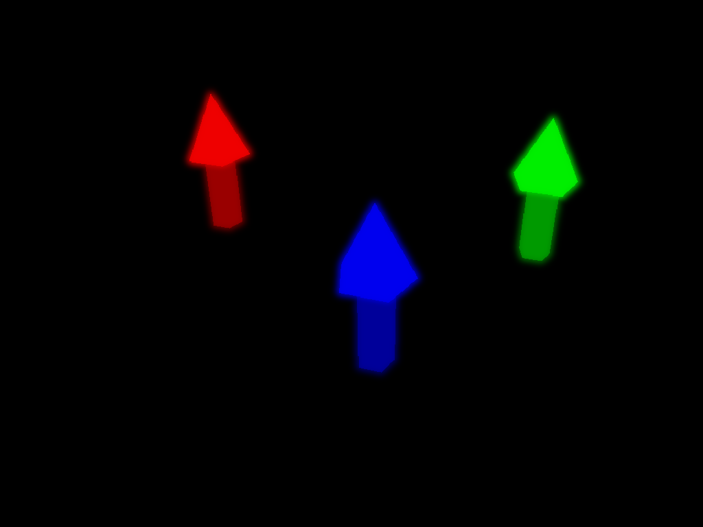
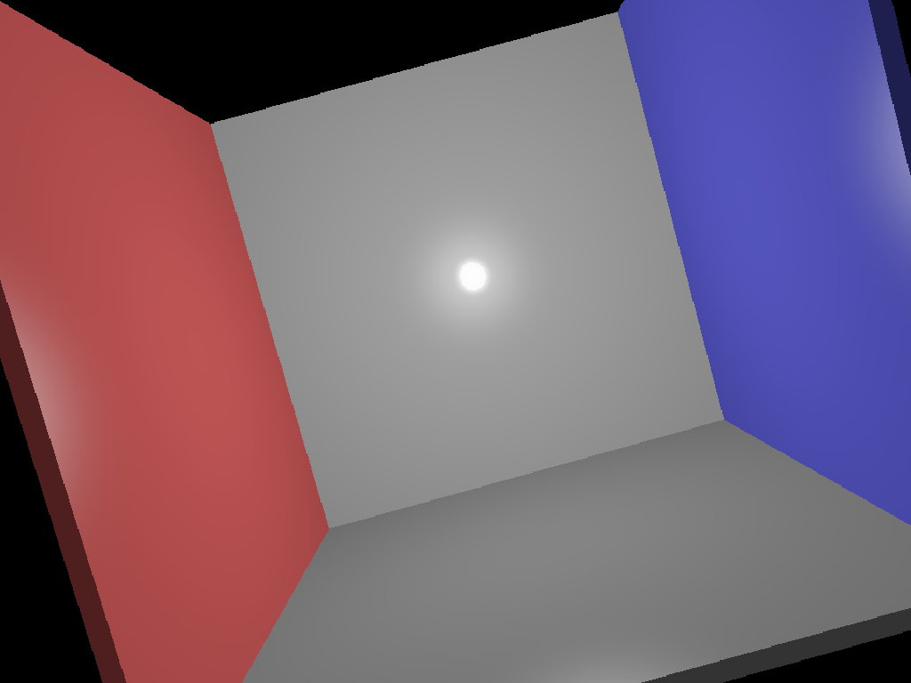
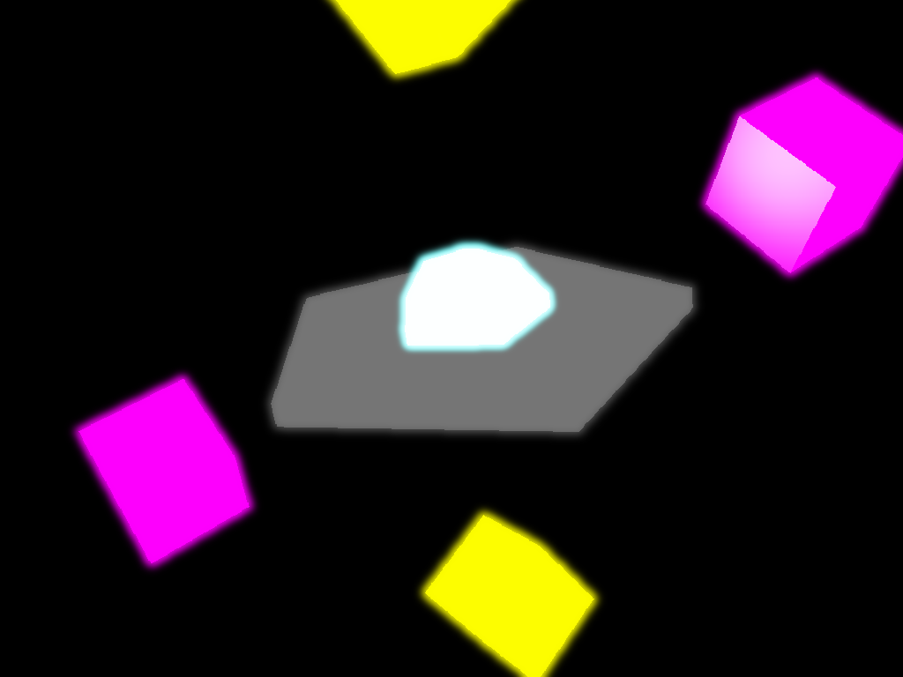
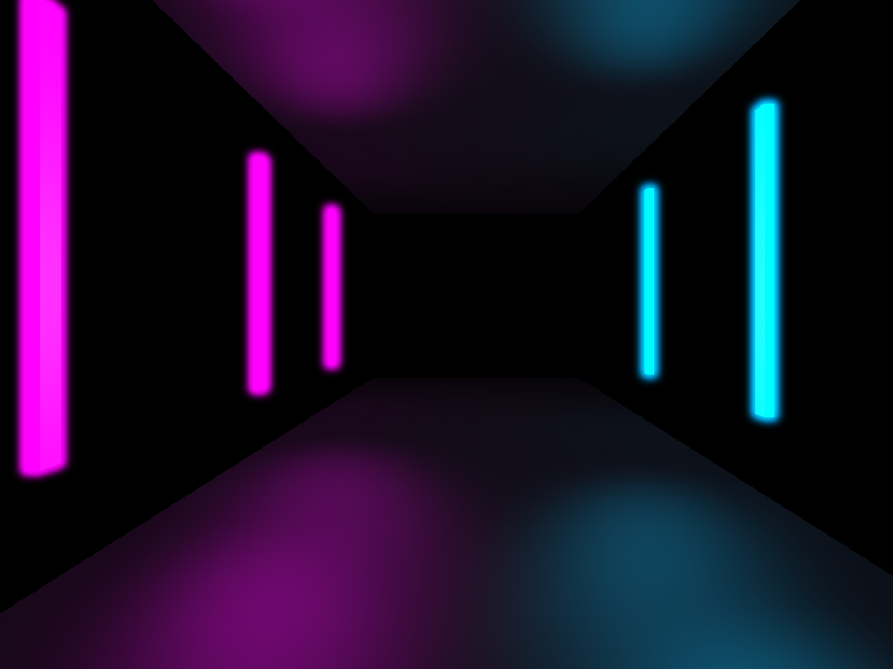
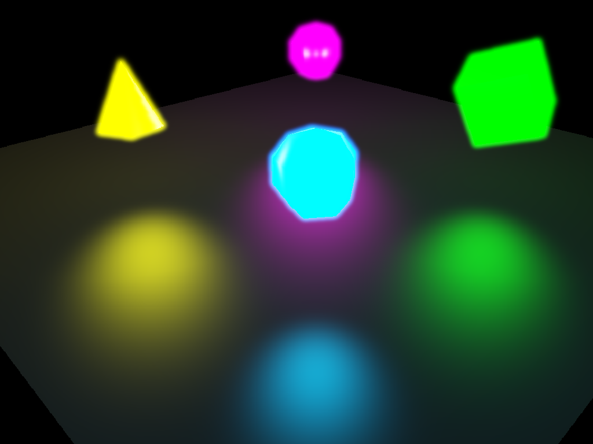

## Project 6: Realtime (Deferred Neon Pipeline)

The project handout can be found [here](https://cs1230.graphics/projects/realtime/1).

### Custom Neon Scenes

Below are the renders from the custom Deferred Rendering pipeline implemented for this project. These scenes demonstrate the **G-Buffer**, **Deferred Lighting**, **Bloom**, and **Tone Mapping** features.

**Note:** Images are located in the `proj6_output/` folder.

| Input Scene File | Rendered Output |
| :---: | :---: |
| **Neon Test** `scenefiles/neon_test.json` |  |
| **The Neon Forest** `scenefiles/neon_forest.json` |  |
| **The Glowing Room** `scenefiles/glowing_room.json` |  |
| **Reactor Core** `scenefiles/reactor_core.json` |  |
| **Cyberpunk Hallway** `scenefiles/cyber_hall.json` |  |
| **Matrix Data Center** `scenefiles/neon_matrix.json` |  |
| **Synthwave Sunset** `scenefiles/synthwave.json` |  |
| **The Void Gate** `scenefiles/void_gate.json` |  |
| **Retro Arcade** `scenefiles/retro_arcade.json` |  |
| **The Hyper Tunnel** `scenefiles/hyper_tunnel.json` |  |

### Design Choices

#### Base Architecture
- **Structure:** Built on top of the existing architecture from previous labs. Reused tessellation logic for cubes, cones, cylinders, and spheres, as well as the scene parsing logic.
- **Phong Lighting:** Implemented fully in the fragment shader using the Phong implementation. Ambient, diffuse, and specular terms are handled manually and computed per light source.
- **Lights:** Implemented a generalized upload system supporting eight mixed lights (directional, point, spot), ensuring flexibility for various scene configurations.
- **Camera:** Implementation follows lecture formulas; movement uses basis vectors, and rotation is handled via Rodrigues-style vector math.

#### Extended Pipeline: Deferred Rendering & Neon Glow
To achieve the "Neon Glow" aesthetic, I completely refactored the rendering engine from Forward Shading to a **Deferred Rendering Pipeline** with advanced Post-Processing.

1.  **Phase 1: Geometry Pass (G-Buffer)**
    * Instead of rendering directly to the screen, I render to a **Multi-Target Framebuffer Object (FBO)** called the G-Buffer.
    * **Attachments:**
        * `GL_COLOR_ATTACHMENT0`: **Position** (World Space, High Precision `GL_RGBA16F`).
        * `GL_COLOR_ATTACHMENT1`: **Normal** (World Space, `GL_RGBA16F`).
        * `GL_COLOR_ATTACHMENT2`: **Albedo** (Diffuse Color).
        * `GL_COLOR_ATTACHMENT3`: **Emissive** (Neon Color, `GL_RGBA16F` for HDR values > 1.0).
    * **Shaders:** `gbuffer.vert` and `gbuffer.frag` handle transforming geometry and outputting raw data to textures.

2.  **Phase 2: Deferred Lighting Pass**
    * Renders a full-screen quad that samples the G-Buffer textures.
    * Lighting calculations (Phong) are done here pixel-by-pixel.
    * **Neon Logic:** The `Emissive` texture is added to the lighting result, allowing "glowing" objects to maintain visibility even in pitch-black scenes.

3.  **Phase 3: Bloom (Post-Processing)**
    * To create the glow, I implemented **Gaussian Blur** on the Emissive texture.
    * **Ping-Pong Buffering:** Used two FBOs to blur the image horizontally and then vertically multiple times (10 iterations) to create a smooth, wide halo effect.

4.  **Phase 4: Composite & Tone Mapping**
    * The final shader mixes the **Lit Scene** with the **Blurred Neon Glow**.
    * **Tone Mapping (Reinhard):** Applied tone mapping to squash high dynamic range (HDR) values back into the visible 0.0-1.0 range, preventing colors from washing out.
    * **Chromatic Aberration:** Added a subtle RGB split offset at the edges to simulate a "glitchy" cyberpunk lens effect.

### Collaboration/References
- Relied heavily on course lectures.
- Used code from Labs 4, 8, and 10.
- I used ChatGPT (OpenAI, GPT-5, 2025) as a debugging/explanation tool.

**Specific ChatGPT Usage:**
* **Translation:** Helped translate shader math and camera rotation formulas from lecture into GLSL/C++ code.
* **Debugging:** Assisted in debugging VAO/VBO mismatches and shape position errors in the fragment shader.
* **Architecture:** Explained how to set up `glDrawBuffers` for the G-Buffer and how to implement Ping-Pong blurring.
* **Integration:** Guided the integration of code from previous labs into this project.

**Types of Prompts used:**
* "Explain shader error: why is nothing appearing being colored in?"
* "Help me implement camera movement."
* "Let's test the setup with one shape first."
* "How do I add a glow effect using Framebuffers?"

### Known Bugs
N/A

### Extra Credit
**Implemented Advanced Deferred Rendering Pipeline:**
* **G-Buffer:** High-precision storage of Position, Normal, Albedo, and Emissive data.
* **Post-Processing:** Implemented Bloom (Gaussian Blur), Tone Mapping (Reinhard), and Chromatic Aberration.
* **Visual Effects:** Created specific "Neon" scenes (`hyper_tunnel.json`, `void_gate.json`, etc.) to demonstrate high-dynamic-range glow and reflection capabilities.
